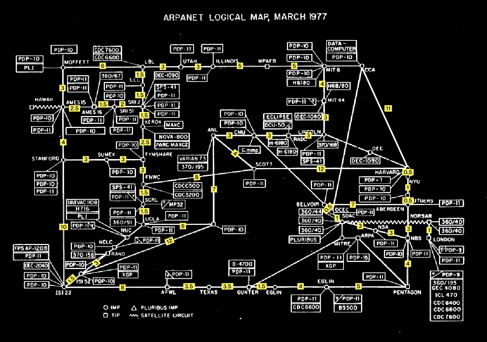

# algos

Some abnormal algorithms in Go

## [Arpanet Closest Route]

Choose two points and returns the closest route.

## [Unicorn Sleep](unicornSleep/main.go)

A faster and more cute version of the sleep sort, which sleep in nanoseconds instead of seconds.

## [Bogosort](bogoSort/main.go) (Stupid Sort)
Shuffle the list randomly until it happens to be sorted. Its average time complexity is factorial, making it one of the worst sorting algorithms ever. It’s a classic example of an intentionally bad algorithm.

## Future Sorts to do

### Solar Bitflip Sort
Check if the array is sorted; if not, wait 10 seconds and pray that solar radiation flips bits in memory, magically sorting the array. Then check again, repeating until sorted. This is a parody of hardware faults fixing your problems.

### The Internet Sort
Perform every comparison by asking the internet, like querying "Which is greater, 0.211 or 0.75?" This is a joke about relying on external, slow, and unreliable sources for sorting.

### Thanos Sort
Inspired by the Marvel character Thanos, randomly delete half the list repeatedly until what remains is sorted. It achieves sorting by destruction rather than rearrangement.

### Miracle Sort
Simply hope or assume that the list magically becomes sorted without any work. It’s a joke about relying on miracles rather than algorithms.
